# SalesCore

**Enterprise CRM, Management Information System, Business Intelligence & Decision Support Platform**

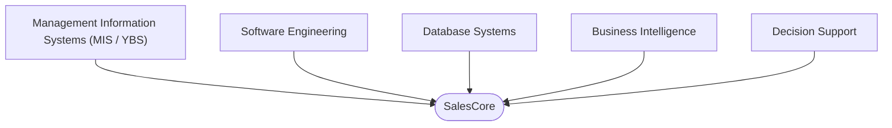

SalesCore was designed as a bridge between Management Information Systems and
software engineering, transforming business processes and organizational data
into operational information, analytics, business insights, and
decision-support capabilities.

It is a full-stack sales and customer relationship management system —
companies, contacts, leads, and a stage-gated deal pipeline — built on top of
a relational database and a server-enforced authorization model, and wrapped
in an analytics layer that turns the resulting transactional data into KPIs,
reports, and plain-language business insights. It was built to apply, in a
single working software product, concepts from Information Systems, Database
Management, Business Process Management, Customer Relationship Management,
and Business Intelligence — not as separate class exercises, but as parts of
one system that depend on each other the way they do in a real organization.

New to the product rather than the code? [`SALESCORE.md`](./SALESCORE.md)
explains what SalesCore does and why, in plain English, through a worked
example — no technical background required. This document is the technical
and academic reference.

**Backend** — Python · FastAPI · SQLAlchemy 2.0 · Alembic · PostgreSQL
**Frontend** — Next.js · TypeScript · React · Tailwind CSS
**Auth** — JWT · Role-Based Access Control
**Infra** — Redis · Docker Compose · GitHub Actions CI

---

## Table of contents

1. [Why SalesCore?](#why-salescore)
2. [The problem](#the-problem)
3. [Core concept](#core-concept)
4. [From MIS concepts to a software system](#from-mis-concepts-to-a-software-system)
5. [Data → Information → Insight → Decision](#data--information--insight--decision)
6. [System architecture](#system-architecture)
7. [Database / ER diagram](#database--er-diagram)
8. [Authorization (RBAC)](#authorization-rbac)
9. [Features](#features)
10. [Business workflow — a worked example](#business-workflow--a-worked-example)
11. [KPI definitions](#kpi-definitions)
12. [Tech stack](#tech-stack)
13. [API overview](#api-overview)
14. [Security](#security)
15. [Testing](#testing)
16. [Project structure](#project-structure)
17. [Running locally](#running-locally)
18. [Deployment (planned)](#deployment-planned)
19. [Project status](#project-status)
20. [Known limitations](#known-limitations)
21. [Academic / MIS perspective](#academic--mis-perspective)
22. [Software engineering perspective](#software-engineering-perspective)
23. [What this project demonstrates](#what-this-project-demonstrates)
24. [Screenshots](#screenshots)

---

## Why SalesCore?

Organizations generate data constantly — every call logged, every deal
updated, every lead created. But data on its own is not decision support.
A spreadsheet full of deal values does not tell a manager *why* revenue is
down this month, and a table of leads does not tell a sales rep which one to
call next. Turning raw operational records into something a person can act
on is exactly the problem Management Information Systems, as a discipline,
exists to solve — and it is the problem SalesCore is built around:

```
Operational Data → Information → Analytics → Business Insights → Decision Support
```

SalesCore implements this chain end-to-end rather than assuming it happens
somewhere else. Every CRM action (creating a company, moving a deal to
"Negotiation", closing a deal as Won) is operational data captured in
PostgreSQL. That data is aggregated into structured information (win rate,
pipeline value, revenue trend). The information is surfaced as analytics
(KPI dashboards, a sales funnel, team performance). A small rule-based engine
turns the analytics into business insights written in plain sentences. And
those insights exist to support a decision a sales manager or executive
actually has to make. This is the MIS perspective SalesCore was built to
demonstrate in working software, not only in diagrams.

---

## The problem

Sales teams often manage customers, leads, deals, activities, targets and
reports across disconnected tools — a spreadsheet for the pipeline, a
separate inbox for follow-ups, no shared record of who owns which account.
In practice this produces:

- **Fragmented information** — no single source of truth for a customer's history.
- **Limited visibility** — a manager cannot see the whole team's pipeline at a glance.
- **Manual reporting** — KPIs get recomputed by hand instead of read off a dashboard.
- **Poor follow-up** — leads and deals stall with no owner accountable.
- **Weak performance monitoring** — no consistent way to compare reps or periods.
- **Delayed management decisions** — by the time a trend is noticed manually, it is old news.

SalesCore addresses this by keeping the customer journey, the access rules
around it, and the analytics derived from it in one relational schema and one
application, so the pipeline a rep updates today is the same data a
manager's dashboard reads a second later.

---

## Core concept

The customer lifecycle SalesCore is organized around, from first contact to
a decision made on top of the accumulated data:

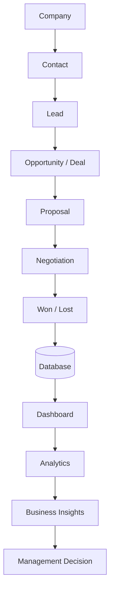

Every box in this diagram is a real part of the product: a `Company` and
`Contact` are records a rep creates; a `Lead` converts into a `Deal`; the deal
advances through a server-enforced pipeline (below); the outcome and every
stage change are persisted; and the dashboard, analytics and Business
Insights engine all read from that same persisted history.

---

## From MIS concepts to a software system

| MIS / Business Concept | SalesCore Implementation |
|---|---|
| CRM | Companies, Contacts, Leads, Deals |
| Business Process | Sales Pipeline (server-enforced stage transitions) |
| Database Management | PostgreSQL + SQLAlchemy 2.0 + Alembic migrations |
| Information Management | Operational CRM data, normalized relational schema |
| Business Intelligence | Analytics & KPI dashboards computed live from the database |
| Management Reporting | Reports module (8 report types, filters, CSV export) |
| Decision Support | Rule-based Business Insights engine |
| Access Control | Role-Based Access Control (5 roles), enforced server-side |
| Organizational Structure | Employees & Departments |
| Performance Management | Sales Targets with live achievement tracking |
| Customer Relationship Management | Customer 360 view |
| Information Security | JWT auth, bcrypt hashing, RBAC, IDOR protection, Pydantic validation |

---

## Data → Information → Insight → Decision

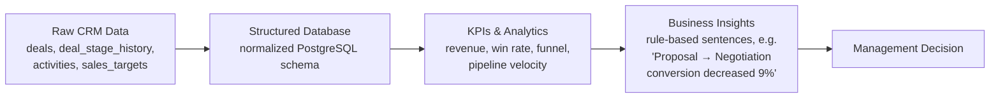

- **Data.** Every deal-stage change, activity log, and target is written as a
  plain fact to PostgreSQL — a row, a timestamp, nothing interpreted yet.
- **Structured database.** SQLAlchemy models and Alembic migrations keep that
  data normalized and relationally consistent (foreign keys, constraints,
  indexes), which is what makes aggregation over it reliable.
- **KPIs & analytics.** `analytics_service.py` aggregates the raw rows into
  metrics — revenue, pipeline value, win rate, conversion rate, funnel
  cohorts — computed with SQL aggregates, not cached snapshots of the past.
- **Business insights.** `get_business_insights()` is a small deterministic,
  rule-based engine (not an LLM) that turns metric thresholds into a sentence
  a manager can read in two seconds, e.g. *"Revenue is tracking at 72% of
  target for the last 30 days."*
- **Decision.** A manager reads that sentence, pulls up the report behind it,
  and acts — reallocates pipeline coverage, coaches a rep, adjusts a target.

See [`SALESCORE.md`](./SALESCORE.md#from-data-to-a-decision) for this same
chain walked through on one concrete deal.

---

## System architecture

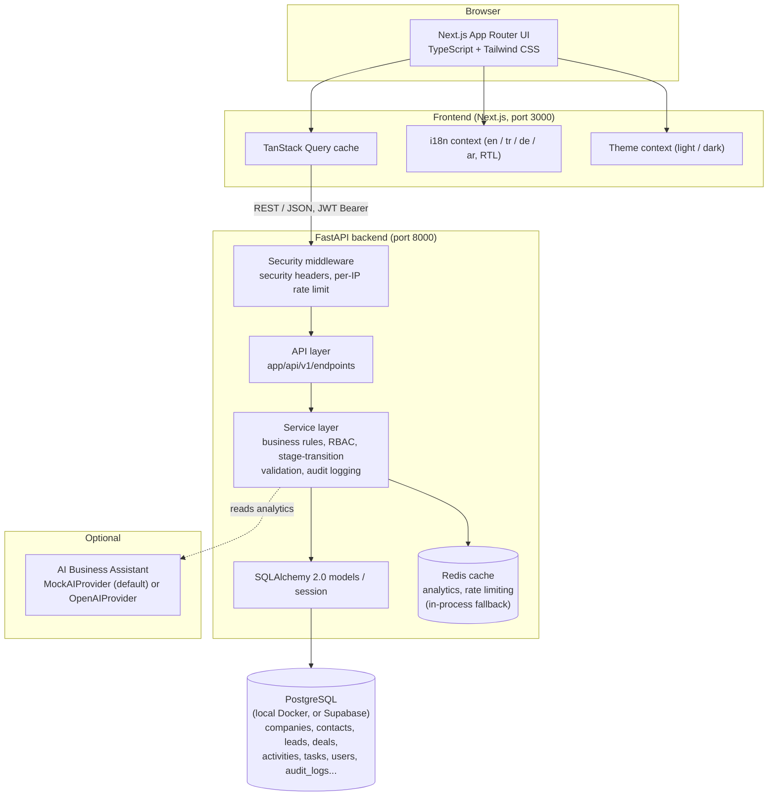

**Layering (backend):** `api` (FastAPI routers, request/response schemas) →
`services` (business logic: ownership checks, deal-stage transition rules,
audit logging, cache invalidation) → SQLAlchemy models/session. Pydantic
schemas keep the wire format decoupled from the ORM models.

**Layering (frontend):** route segments under `app/(app)/*` are guarded by an
`AuthProvider`; each domain has a `lib/hooks/use-*.ts` TanStack Query hook
file and, where forms are needed, a `components/<domain>/*FormModal.tsx`
built with React Hook Form + Zod.

The database has been run and migrated against both a local Dockerized
PostgreSQL instance and a managed **Supabase PostgreSQL** instance in this
project's development history (see [Testing](#testing)); the connection
target is a single `DATABASE_URL` environment variable, not a code path.

### Planned production architecture

The application has **not** been deployed yet. This is the intended target
architecture for a free-tier deployment, not a description of a running
system:

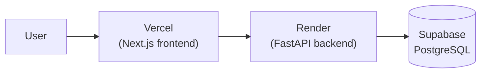

### The sales lifecycle is a server-enforced state machine

The kanban board's drag-and-drop is a UI convenience; the actual guarantee is
this state machine, enforced on the backend (`DEAL_STAGE_TRANSITIONS` in
`app/models/enums.py`) — a request that skips a stage is rejected with a
structured `422` error regardless of what the UI allowed:

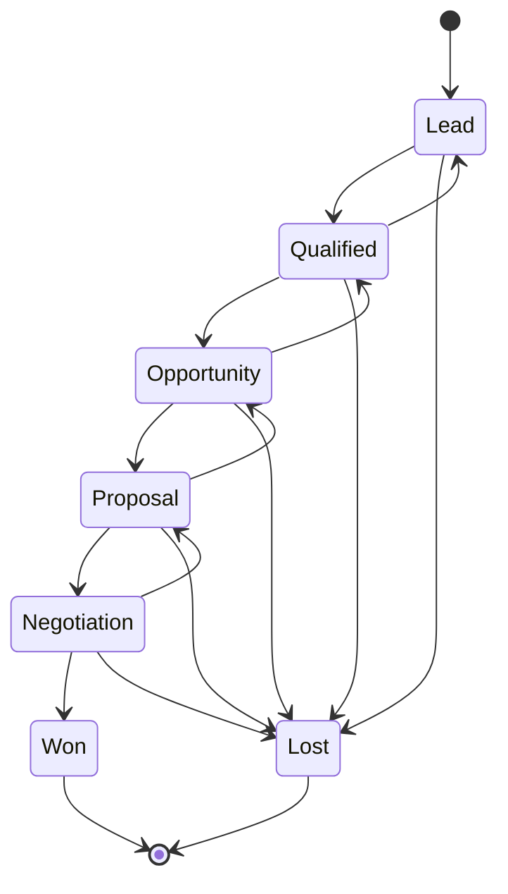

Every transition is appended to `deal_stage_history`, which is what makes the
sales funnel a genuine cohort analysis ("N deals reached Proposal") instead
of a current-snapshot count, and what renders as the timeline on the deal
detail page.

---

## Database / ER diagram

Relational schema (PostgreSQL via SQLAlchemy 2.0 models, one file per entity
under `backend/app/models/`), migrated with Alembic:

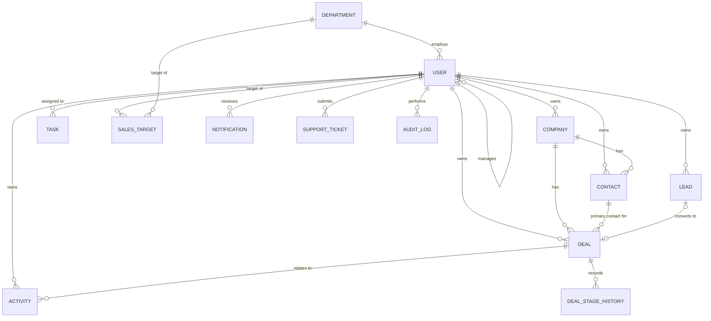

Only relationships that exist as real foreign keys in the SQLAlchemy models
are shown. Key constraints and indexes defined on the models (`users.email`
unique, `departments.name` unique, `deals.stage` indexed, `audit_logs.entity_type`
indexed, and others) are captured in the Alembic migration history at
`backend/alembic/versions/`. `KnowledgeCategory`/`KnowledgeTerm` form a
separate, self-contained glossary module with no foreign key into the CRM
tables above and are omitted from this diagram for clarity.

---

## Authorization (RBAC)

Authorization is enforced **server-side, per record**, in `app/core/rbac.py`
and applied inside every service function — not just hidden UI buttons on the
frontend. A Sales Rep who guesses another rep's deal ID in the URL receives a
`403`, not the record; this is covered by `backend/tests/test_rbac.py`.

| Role | Main Responsibility | Access Scope |
|---|---|---|
| **Admin** | Full system administration, including employees/departments | Everything, read and write |
| **Manager** | Manages the whole team's CRM data, targets and reports | Everything, read and write |
| **Sales Representative** | Runs their own pipeline and customer relationships | Only records they own — read and write |
| **Analyst** | Reviews analytics and reports across the organization | Everything, read-only |
| **Viewer** | General visibility without edit rights | Everything, read-only |

**Ownership scope for Sales Reps.** `scope_to_owner_only()` returns `True`
only for the `SALES_REP` role; every list, dashboard, and analytics query for
that role is additionally filtered to `owner_id == current_user.id`. This is
the same rule applied consistently to the CRM record endpoints, the KPI
summary, and the report generator — a Sales Rep's dashboard is computed from
their own deals only, never the whole organization's pipeline.

**New accounts.** Self-registration (`POST /auth/register`) is enabled: the
first account created in an empty workspace bootstraps as **Admin**, so there
is always someone able to manage employees and departments; every account
registered after that starts as **Sales Rep**, scoped to only the records
they create, which mirrors how most B2B SaaS products bootstrap a fresh
workspace. An Admin can promote an account to a different role afterward
(`PATCH /employees/{id}`).

**Frontend authorization is not security.** The UI hides actions a role
cannot perform for usability, but every enforcement decision is made again on
the backend regardless of what the client sends. Concretely, this includes:

- **Password hashing** with bcrypt (`passlib`) — plaintext passwords are never stored.
- **JWT validation** (`python-jose`) against an explicit algorithm allowlist
  (`jwt.decode(..., algorithms=[settings.JWT_ALGORITHM])`), not "whatever the
  token header claims" — this rules out algorithm-confusion attacks.
- **Active-user checks** on every authenticated request — a deactivated
  user's still-valid JWT is rejected (`get_current_user` in `app/core/deps.py`).
- **IDOR protection** — `assert_can_access_owned_record` /
  `assert_can_modify_owned_record` check record ownership before every read
  or write a Sales Rep performs, independent of what the URL/ID is.
- **Pydantic request validation** on every endpoint, rejecting malformed or
  out-of-range input before it reaches business logic.

---

## Features

### CRM
- Companies, contacts and leads with search, filtering, sorting and pagination.
- Lead → Deal conversion (reuses/creates the company, starts a Qualified deal).
- Customer 360 view (`GET /companies/{id}/360`): lifetime value, deal counts by outcome, contact count, last communication.

### Sales Management
- Deals with a drag-and-drop Kanban pipeline (Lead → Qualified → Opportunity → Proposal → Negotiation → Won/Lost), backed by the server-enforced state machine above.
- Full deal stage history, rendered as a timeline on the deal detail page.
- Activities (call, email, meeting, note, follow-up, demo, proposal) linked to companies/contacts/deals.
- Tasks with priority, due date and completion tracking.
- Sales targets (monthly/quarterly/yearly, per employee or department) with live achievement percentage.

### Business Intelligence
- KPI cards: revenue, pipeline value, won deals, conversion rate, win rate, average deal size, active customers, sales target achievement — each with a period-over-period change indicator.
- Sales funnel (cohort "reached this stage" counts from `deal_stage_history`, not just a current snapshot).
- Revenue trend, win/loss trend, customer segmentation, customer growth, pipeline velocity, and a team performance leaderboard.

### Reporting
- 8 report types (`sales`, `customers`, `employee-performance`, `revenue`, `lead-conversion`, `pipeline`, `activity`, `kpi`) with date-range filters, sorting, pagination, and CSV export.

### Decision Support
- **Business Insights** (`GET /analytics/insights`): a small rule-based engine that turns the live metrics into plain-language findings a manager can act on, without an LLM call.
- **AI Business Assistant** (optional, `POST /ai/ask`): a `MockAIProvider` (default, answers from the same live analytics, no API key required) or an `OpenAIProvider`, selected by `AI_PROVIDER`.

### Productivity
- Global search (`GET /search`) across customers, contacts, leads, deals, tasks, employees and knowledge terms.
- Notifications (task due, deal won/lost, new lead, target reached) with an unread count and click-through.
- An in-app "What is SalesCore" walkthrough page (`/about`) and a guided product tour / onboarding welcome for first-time users.

### Support
- Support ticket submission and a personal ticket list for any signed-in user.
- A separate admin ticket queue (`/support/admin/tickets`) with status updates.
- Per-user rate limiting on ticket submission (`SUPPORT_TICKETS_PER_HOUR`, default 5/hour).

### Internationalization
- Four languages — English, Turkish, German, Arabic — via JSON dictionaries (`frontend/locales/{en,tr,de,ar}/common.json`, 637 keys each, kept at 1:1 parity).
- Arabic is a full RTL experience: `document.dir` flips and layout, navigation and charts mirror accordingly, not just translated strings.

### UX
- Dark/light theme, responsive layout down to phone widths, a branded app icon/manifest, and an animated startup splash shown once per real page load.

---

## Business workflow — a worked example

SalesCore's own seed/demo narrative follows one company from first contact to
a management decision, exercising the full chain end to end:

1. **Company.** A rep creates a **Company** record for *Atlas Furniture Co.*
   — industry, size, country. No sale yet; a filing-cabinet entry.
2. **Contact.** Maria, Atlas's Head of Operations and the actual decision
   maker, is added as a **Contact** attached to that company.
3. **Lead.** After a conversation, interest in replacing Atlas's inventory
   software is captured as a **Lead** — a source, a status, not yet a commitment.
4. **Deal.** Once budget and need are confirmed, the rep converts the lead
   into a **Deal**, which starts at the Qualified stage with an estimated value.
5. **Qualified → Opportunity → Proposal → Negotiation.** The deal advances
   through the pipeline one stage at a time — the server rejects any attempt
   to skip a stage — with every transition timestamped in `deal_stage_history`.
6. **Won.** The deal is marked **Won**; Atlas becomes a paying customer, and
   its Customer 360 view now shows a "customer since" date and lifetime value.

From there, the same event flows forward automatically:

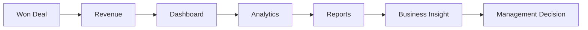

The revenue from the Atlas deal is picked up by the next KPI computation, it
moves the revenue-trend and win-rate charts, it is queryable through the
Reports module, it can trigger a Business Insight sentence if it changes a
metric meaningfully, and it is now something a manager can act on — without
anyone having manually re-entered or re-aggregated anything.

---

## KPI definitions

All KPIs are computed live from PostgreSQL by `analytics_service.py` using
SQL aggregate queries (short-TTL cached per `days`/owner scope, not
pre-computed or hardcoded):

| KPI | Calculation |
|---|---|
| **Revenue** | Sum of `Deal.value` for deals with `stage = WON` and `actual_close_date` inside the selected period |
| **Pipeline Value** | Sum of `Deal.value` for open deals (`stage` not in `WON`/`LOST`) |
| **Won Opportunities** | Count of deals with `stage = WON` closed inside the period |
| **Win Rate** | `Won / (Won + Lost)` among deals closed inside the period |
| **Conversion Rate** | Of deals *created* in the period, the share that have (by now) reached `WON` — a cohort measure, distinct from Win Rate |
| **Average Deal Size** | `Revenue / Won Opportunities` for the period |
| **Active Customers** | Distinct companies with a deal updated inside the period |
| **Sales Target Achievement** | Current calendar month's won revenue ÷ the applicable `SalesTarget.target_amount` (the Sales Rep's own target if scoped to one, otherwise company/department-wide targets) |

Every one of the metrics above is scoped by the same RBAC rule as the CRM
list endpoints: a Sales Rep's KPI values reflect only deals they own.

---

## Tech stack

**Frontend**

| | |
|---|---|
| Framework | Next.js 16 (App Router), React 19, TypeScript |
| Styling | Tailwind CSS v4 |
| Data fetching | TanStack Query |
| Forms | React Hook Form + Zod |
| Charts | Recharts |
| Drag and drop | dnd-kit |
| Icons / toasts | Lucide, Sonner |

**Backend**

| | |
|---|---|
| Framework | FastAPI (Python 3.12) |
| ORM / migrations | SQLAlchemy 2.0, Alembic |
| Validation | Pydantic v2 |
| Auth | python-jose (JWT), passlib + bcrypt |
| Testing | Pytest |

**Database**

PostgreSQL — run locally via Docker Compose, or as a managed **Supabase**
instance (both have been used and migrated during this project's
development). SQLite is supported only as a zero-setup local development
convenience; it is not exercised by the Alembic migration history and is not
used in CI or in the Supabase-backed testing described below.

**Infrastructure**

Redis (analytics cache / rate limiting, with an automatic in-process
fallback if unavailable), Docker Compose, GitHub Actions CI.

**Quality tooling**

Ruff (backend lint + format), Pytest (backend tests), ESLint + the React
Compiler's `react-hooks` rules, Prettier, and `tsc --noEmit` (frontend).

---

## API overview

Versioned REST API under `/api/v1`, with interactive documentation generated
by FastAPI at `/api/docs` (Swagger UI) and `/api/redoc`. Every error response
follows a consistent envelope:

```json
{ "success": false, "error": { "code": "DEAL_NOT_FOUND", "message": "The requested deal was not found." } }
```

Endpoint groups, one router per domain (`backend/app/api/v1/endpoints/`):

```
/auth              login, register, me, change-password
/companies         CRUD, /companies/{id}/360 (Customer 360)
/contacts          CRUD
/leads             CRUD, /leads/{id}/convert
/deals             CRUD, /deals/pipeline, /deals/{id}/history, /deals/{id}/stage
/activities        CRUD
/tasks             CRUD
/employees         CRUD (Admin-managed)
/departments       CRUD
/sales-targets     list, create, delete
/analytics         kpis, funnel, revenue, team-performance, segmentation,
                    win-loss, pipeline-velocity, customer-growth, insights
/reports           types, {report_type} (filters, pagination, CSV export)
/knowledge         categories, terms, terms/{key}
/notifications     list, unread-count, {id}/read, read-all
/audit-logs        list
/search            global search
/ai                ask (AI Business Assistant)
/support           tickets (create/list/detail), admin/tickets
```

---

## Security

- **Passwords** hashed with bcrypt (`passlib`), never stored or logged in plaintext.
- **Sessions** are stateless JWT bearer tokens (`python-jose`, HS256, an
  explicit algorithm allowlist on decode), 12-hour expiry by default.
- **Authorization is enforced server-side, per record** — see
  [Authorization (RBAC)](#authorization-rbac).
- **Security headers** on every response (`X-Content-Type-Options: nosniff`,
  `X-Frame-Options: DENY`, `Referrer-Policy: strict-origin-when-cross-origin`,
  `X-XSS-Protection`).
- **Per-IP rate limiting** on `/api/v1/*` — a fixed-window limiter backed by
  the shared cache, `RATE_LIMIT_PER_MINUTE` (default 120/minute), returning a
  structured `429`.
- **CORS** is an explicit origin allow-list (`CORS_ORIGINS`), not a wildcard.
- **Production-safety guard**: `core/config.py` refuses to start the app when
  `ENV=production` and `JWT_SECRET_KEY` or `DATABASE_URL` are still their
  insecure development defaults (covered by `backend/tests/test_config.py`).
- **Outbound email is plain-text only** (`EmailMessage.set_content`, never
  HTML-interpolated), so user-supplied support-ticket content cannot inject
  markup into a notification email; SMTP is entirely optional and the app
  fails soft (the ticket is still saved) if it isn't configured.
- **Audit trail**: every write to a tracked entity is recorded in
  `audit_logs` (actor, action, entity type/id, timestamp).
- **Secrets are environment-based**, never committed — `.env` is git-ignored.

These are the concrete mechanisms actually implemented; this section
describes them, not a claim that the system is "fully secure" or
"enterprise-grade" in any audited or certified sense.

---

## Testing

**Backend** — `pytest -q` from `backend/`: **131 tests passed**, covering
authentication and self-registration bootstrap rules, password change,
company/contact/lead/deal/task/activity/department/sales-target CRUD,
pagination and filters, deal stage-transition rules (including terminal
states and invalid skips), lead conversion, sales-target achievement
calculation, audit-log recording, RBAC/IDOR protection across every CRM
resource, analytics correctness on both an empty database and after
creating/winning a deal, and the `ENV=production` insecure-defaults guard.
Tests run against an isolated in-memory SQLite database via
dependency-injected sessions (`backend/tests/conftest.py`).

- **Ruff lint** (`ruff check .`): pass.
- **Ruff format check** (`ruff format --check .`): currently flags 3 files as
  not yet reformatted to the latest formatter output — noted here rather than
  silently claimed clean.

**Frontend** — from `frontend/`:
- `tsc --noEmit`: pass.
- `npm run lint` (ESLint, incl. React Compiler `react-hooks` rules): pass.
- `npm run format:check` (Prettier): pass.
- `npm run build` (production build): pass — all 27 routes compile and prerender successfully.

There is no automated frontend test suite (Playwright/Vitest) yet; see
[Known limitations](#known-limitations).

**Live database verification (Supabase PostgreSQL).** Beyond the isolated
test database above, this project's Alembic migrations were applied to a
real, managed Supabase PostgreSQL instance, and the full application was run
against it with `uvicorn` to exercise an end-to-end smoke test over HTTP:
register → login → `/auth/me` → create company → create contact → create
lead → create deal → advance the deal through the pipeline to Won →
dashboard/KPIs → Customer 360 → reports. Every step succeeded, and the
resulting rows (including the full `deal_stage_history` for the won deal)
were independently confirmed with direct SQL queries against Supabase, then
removed again afterward — the schema currently applied to that instance is
verified, but no demo data is left in it.

---

## Project structure

```
salescore/
├── docker-compose.yml
├── .env.example
├── .github/workflows/ci.yml        # lint + test + build, on every push/PR
├── docs/screenshots/                # images used in this README
├── SALESCORE.md                     # plain-English product walkthrough
├── backend/
│   ├── app/
│   │   ├── api/v1/endpoints/        # FastAPI routers (one file per domain)
│   │   ├── core/                    # config, security, rbac, cache, middleware, email
│   │   ├── models/                  # SQLAlchemy models
│   │   ├── schemas/                 # Pydantic request/response schemas
│   │   ├── services/                # business logic, one file per domain
│   │   └── seed/                    # demo data + knowledge base content
│   ├── alembic/versions/            # database migrations
│   ├── pyproject.toml               # Ruff lint + format config
│   └── tests/
└── frontend/
    ├── app/
    │   ├── icon.tsx, apple-icon.tsx, manifest.ts   # generated brand icons + PWA manifest
    │   ├── login/, register/
    │   └── (app)/                   # authenticated routes: dashboard, crm, sales,
    │                                 # analytics, reports, operations, knowledge, support,
    │                                 # about, settings
    ├── components/
    │   ├── layout/                  # Sidebar, Navbar, Logo, Splash
    │   ├── onboarding/               # guided tour, welcome screen, guide panel
    │   ├── ui/, charts/               # design-system primitives, chart components
    │   └── <domain>/                  # per-domain form modals
    ├── lib/
    │   ├── contexts/                 # auth, theme, i18n, onboarding
    │   ├── hooks/                    # TanStack Query hooks, one file per domain
    │   ├── deal-stages.ts             # frontend mirror of the stage-transition rules
    │   └── types.ts                   # frontend mirror of backend schemas
    └── locales/{en,tr,de,ar}/common.json
```

---

## Running locally

### Option A — Docker Compose (recommended)

```bash
cp .env.example .env
docker compose up --build
docker compose exec backend alembic upgrade head
docker compose exec backend python -m app.seed.seed_data
```

Open **http://localhost:3000**.

### Option B — Run natively (no Docker)

Backend (macOS/Linux):

```bash
cd backend
python -m venv .venv && source .venv/bin/activate
pip install -r requirements.txt
echo DATABASE_URL=sqlite:///./dev.db > .env
python -m app.seed.seed_data
uvicorn app.main:app --reload --port 8000
```

Backend (Windows PowerShell):

```powershell
cd backend
python -m venv .venv
.\.venv\Scripts\Activate.ps1
pip install -r requirements.txt
"DATABASE_URL=sqlite:///./dev.db" | Out-File -Encoding utf8 .env
python -m app.seed.seed_data
uvicorn app.main:app --reload --port 8000
```

Frontend (separate terminal):

```bash
cd frontend
npm install
echo NEXT_PUBLIC_API_URL=http://localhost:8000/api/v1 > .env.local
npm run dev
```

> Redis is optional in native mode — `app/core/cache.py` falls back to an
> in-process cache automatically, so the app still runs without it (rate
> limiting and analytics caching just become per-process instead of shared).

### Environment variables

See [`.env.example`](.env.example) for the full list with defaults.

| Variable | Purpose |
|---|---|
| `DATABASE_URL` | SQLAlchemy connection string — local Postgres, a managed Postgres provider such as Supabase, or SQLite for quick local dev |
| `REDIS_URL` | Cache / rate-limit backend (optional — falls back gracefully) |
| `JWT_SECRET_KEY` | Signs JWTs — change this in any real deployment |
| `ENV` | `development` (default) or `production` — see the production-safety guard in [Security](#security) |
| `CORS_ORIGINS` | JSON array of allowed frontend origins |
| `RATE_LIMIT_PER_MINUTE` | Per-IP request cap on `/api/v1/*` |
| `AI_PROVIDER` | `mock` (default) or `openai` |
| `SMTP_HOST` / `SUPPORT_EMAIL` / `SUPPORT_FROM_EMAIL` | Optional — support-ticket email notifications; the app runs fine with these unset |
| `NEXT_PUBLIC_API_URL` | Frontend → backend base URL |

`.env` is git-ignored; never commit real secrets or database credentials.

**Using a managed PostgreSQL provider (e.g. Supabase).** Set `DATABASE_URL`
to the provider's connection string with the `postgresql+psycopg://` scheme
(SQLAlchemy + psycopg3), then run `alembic upgrade head` from `backend/` to
apply the schema. This project's own migration history has been verified
against a live Supabase instance this way (see [Testing](#testing)).

---

## Deployment (planned)

SalesCore has **not** been deployed to a public environment. The intended,
free-tier deployment plan is:

- **Frontend** → Vercel (Next.js)
- **Backend** → Render (FastAPI)
- **Database** → Supabase PostgreSQL

See [Planned production architecture](#planned-production-architecture) for
the corresponding diagram. Before any real deployment, the items under
`ENV=production` in [Security](#security) — a real `JWT_SECRET_KEY`, a real
`DATABASE_URL`, and TLS termination at a reverse proxy or platform edge —
still need to be set through the deployment platform's secret manager.

---

## Project status

**Feature complete / final demo ready.** The CRM, pipeline, RBAC, analytics,
reporting, and i18n described in this document are implemented and covered
by the backend test suite and manual/browser verification described in
[Testing](#testing). The application has not yet been deployed to a public
production environment — see [Deployment (planned)](#deployment-planned).

---

## Known limitations

- **Single-organization architecture.** There is no multi-tenant
  workspace/organization isolation; the current architecture is designed
  around one organization, with visibility and write access controlled
  entirely by role and record ownership (RBAC), not by tenant.
- **No frontend automated test suite.** Frontend correctness currently rests
  on TypeScript, ESLint, a production build, and manual/browser-driven
  verification — there is no Playwright/Vitest suite yet.
- **SQLite is a local-development convenience only.** Production and the
  Supabase-verified path both use PostgreSQL; SQLite is not part of the
  Alembic migration history and is not used in CI or in the live-database
  testing described in [Testing](#testing).
- **Free-tier deployment limitations.** The planned Vercel/Render/Supabase
  stack has free-tier constraints (cold starts, connection limits) that a
  paid tier would remove; this has not been load-tested.
- **Mobile visual validation is incomplete.** Responsive layout has been
  implemented and reviewed in-browser at reduced viewport widths, but has not
  been fully validated on physical mobile devices.
- **Background jobs run synchronously.** There is no task queue (Celery/RQ);
  analytics queries are cheap enough at this data scale to run inline.
- **Business Insights / AI Assistant text is English-only** regardless of UI language.

---

## Academic / MIS perspective

SalesCore was built to demonstrate, in one working system rather than in
isolated exercises, how the core concerns of Management Information Systems
compose into a single product:

- **CRM** as the operational core — the customer journey the rest of the system measures.
- **Database management** as the foundation everything else depends on being correct and normalized.
- **Business process management** as an enforced rule (the pipeline state machine), not a suggestion.
- **Business intelligence** as live aggregation over the same operational data, not a separate reporting silo.
- **Decision support** as the explicit purpose of that aggregation — a system that stops at "here are some numbers" has not finished the job.
- **Information security** as an access-control model (RBAC) tied directly to organizational roles, mirroring how access is actually reasoned about in a business.
- **Management reporting and organizational data** — departments, employees, targets — as first-class records, not an afterthought bolted onto a CRM.

The intent was to show these concepts working together under real
constraints (concurrent users, consistency, authorization boundaries),
which a diagram alone cannot demonstrate.

---

## Software engineering perspective

- **Layered architecture** — API routers, service layer, ORM/data layer, kept intentionally separate (see [System architecture](#system-architecture)).
- **REST API design** with a consistent resource model, pagination, filtering, and a uniform error envelope.
- **ORM and migrations** — SQLAlchemy 2.0 models with Alembic-managed schema evolution, rather than hand-written SQL scattered through the codebase.
- **Authentication and authorization** implemented as explicit, testable code (JWT issuance/validation, an RBAC module), not framework defaults left unexamined.
- **Input validation** at the API boundary via Pydantic schemas, decoupled from the ORM models.
- **Automated testing** — 131 backend tests exercising business rules, RBAC/IDOR boundaries, and edge cases (see [Testing](#testing)).
- **Continuous integration** — GitHub Actions running lint, format-check, and tests/build on every push and pull request.
- **Environment-based configuration** with a production-safety guard that refuses insecure defaults at startup.
- **Caching** with a graceful fallback path (Redis → in-process) rather than a hard dependency.
- **Internationalization** as a real architecture (locale JSON + context provider + RTL handling), not hard-coded UI strings.
- **Responsive, accessible UI** — a component library, dark/light theming, and layouts verified down to phone widths.

---

## What this project demonstrates

- Full-stack application development across a Python/FastAPI backend and a TypeScript/Next.js frontend.
- Relational database design and schema migration management.
- Authentication and role-based authorization, enforced server-side and tested against IDOR scenarios.
- Business process modeling as enforced application logic (the deal-stage state machine).
- Business intelligence and analytics computed from live relational data.
- Decision-support concepts implemented as a deterministic insight-generation layer.
- Automated backend testing and CI, plus a verified end-to-end run against a real managed PostgreSQL database.
- Production-oriented concerns — configuration safety guards, rate limiting, security headers, CORS — considered and implemented, not left as an exercise for later.

---

## Screenshots

| Dashboard | Sales pipeline |
|---|---|
| 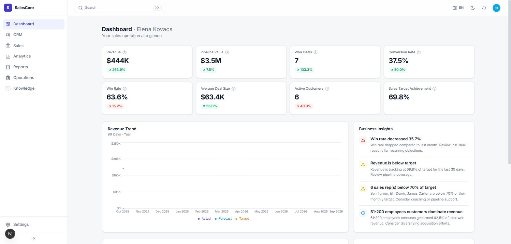 | 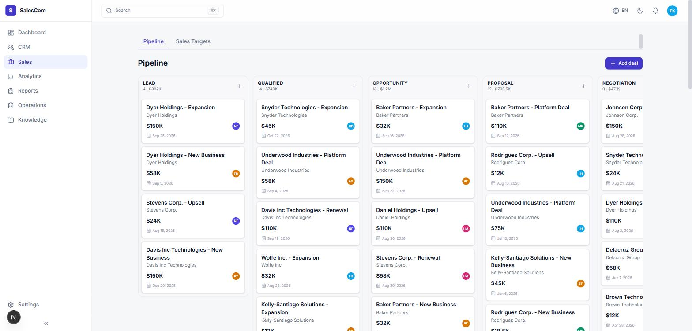 |

| Customer 360 | Analytics / BI |
|---|---|
| 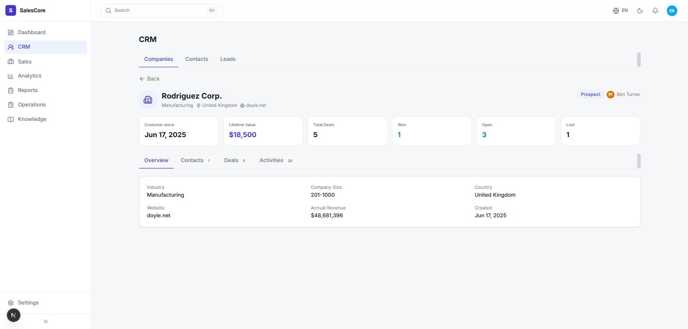 | 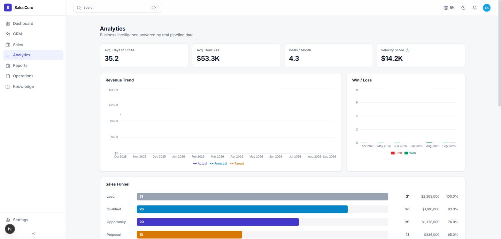 |

All four are the live application, not mockups.

---

## License

Built as an academic capstone / portfolio project. No license file is
included — add one before any public redistribution.
