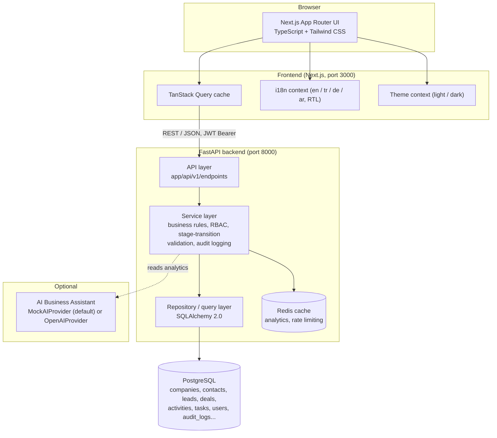

# SalesCore

**Business Sales & Customer Relationship Management Platform**

SalesCore is a full-stack CRM + Management Information System (YBS) + Business
Intelligence platform. It is built to look and behave like a real SaaS product a
sales organization would run internally — not a CRUD scaffold — combining:

- **CRM**: companies, contacts, leads, deals, activities, tasks, a drag-and-drop
  sales pipeline, and a Customer 360 view.
- **YBS (Management Information System)**: departments, employees, role-based
  access control enforced on the server, sales targets, and a full audit log.
- **BI / Analytics**: KPIs, sales funnel, revenue trend & forecast, win/loss,
  customer segmentation, pipeline velocity, team performance — all computed
  live from the relational data, plus a rule-based "Business Insights" engine
  and an optional AI Business Assistant.
- **Knowledge**: a searchable, four-language CRM/Sales/Finance/BI glossary
  wired directly into the product — metric labels on the dashboard link to
  their definition, so the app teaches the domain it operates in.

---

## Table of contents

1. [Screenshots](#screenshots)
2. [Architecture](#architecture)
3. [Tech stack](#tech-stack)
4. [Features](#features)
5. [Database](#database)
6. [Authentication & RBAC](#authentication--rbac)
7. [Internationalization](#internationalization)
8. [Running locally](#running-locally)
9. [Environment variables](#environment-variables)
10. [Testing](#testing)
11. [API overview](#api-overview)
12. [Project structure](#project-structure)
13. [Future improvements](#future-improvements)

---

## Screenshots

_Add screenshots of the dashboard, pipeline kanban, and knowledge base here before
publishing — run the app locally (see below) and capture them from the browser._

---

## Architecture



**Layering (backend):** `api` (FastAPI routers, request/response schemas) →
`services` (business logic: ownership checks, deal-stage transition rules, audit
logging, cache invalidation) → SQLAlchemy models/session. Pydantic schemas keep
the wire format decoupled from the ORM models.

**Layering (frontend):** route segments under `app/(app)/*` are guarded by an
`AuthProvider`; each domain has a `lib/hooks/use-*.ts` TanStack Query hook file
and, where forms are needed, a `components/<domain>/*FormModal.tsx` built with
React Hook Form + Zod.

---

## Tech stack

**Backend** — Python 3.12, FastAPI, Pydantic v2, SQLAlchemy 2.0, Alembic,
PostgreSQL, Redis, JWT (python-jose), bcrypt (passlib), Pytest.

**Frontend** — Next.js 16 (App Router), TypeScript, React 19, Tailwind CSS v4,
TanStack Query, React Hook Form + Zod, Recharts, dnd-kit, Lucide icons, Sonner
toasts.

**Infrastructure** — Docker Compose (PostgreSQL, Redis, backend, frontend).
Everything runs fully locally with no paid service required.

---

## Features

### CRM
- Companies, contacts, leads with search, filtering, sorting and pagination.
- Lead → Deal conversion (creates/reuses the company and starts a qualified deal).
- Customer 360 view: lifetime value, deal history, contacts, activities.
- Activities (call, email, meeting, note, follow-up, demo, proposal) and a
  personal/team task list with priorities and due dates.

### Sales
- Drag-and-drop Kanban pipeline (Lead → Qualified → Opportunity → Proposal →
  Negotiation → Won/Lost), backed by a server-enforced stage-transition state
  machine — invalid transitions (e.g. Lead → Won) are rejected with a 422 and a
  structured error code, not just hidden in the UI.
- Every stage change is recorded in `deal_stage_history` and rendered as a
  timeline on the deal detail page.
- Sales targets (monthly, per rep or per department) with live achievement %.

### Analytics / BI
- KPI cards (revenue, pipeline value, won deals, conversion rate, win rate,
  average deal size, active customers, target achievement), each with a
  period-over-period change indicator.
- Sales funnel computed from `deal_stage_history` (cohort "reached this stage"
  counts, not just current snapshot), revenue trend with target/forecast/
  previous-period lines, win/loss trend, customer segmentation, pipeline
  velocity, and a team performance leaderboard.
- **Business Insights**: a small rule-based engine (`analytics_service.get_business_insights`)
  that turns the raw metrics into sentences like *"Proposal → Negotiation
  conversion decreased 9% this month"* — the Data → Information → Analysis →
  Decision chain described in the product brief, without requiring an LLM.
- **AI Business Assistant** (optional): `AIProvider` abstraction with a
  `MockAIProvider` (default, rule-based, answers from the same live analytics —
  no API key needed) and an `OpenAIProvider` you can enable by setting
  `AI_PROVIDER=openai` and `OPENAI_API_KEY`.

### YBS / Operations
- Employees, departments, and role-based access control **enforced server-side**
  (see below) — not just hidden buttons.
- Full audit log (`audit_logs`): who did what, to which entity, when.
- Reports module: 8 report types, date-range filters, sorting, pagination, and
  CSV export.

### Knowledge
- A searchable glossary (CRM, Sales, Marketing, Finance, Management, BI, YBS,
  Software, Analytics categories) with full translations in English, Turkish,
  German and Arabic for every term.
- Dashboard/analytics metric labels carry a small **"?"** affordance
  (`MetricHelp`) that shows the term's short definition on hover and links to
  the full glossary entry on click.

### Platform
- Global search (`Cmd/Ctrl+K` or `/`) across customers, contacts, leads, deals,
  tasks, employees and knowledge terms.
- Notifications (task due, deal won/lost, new lead, target reached) with an
  unread badge.
- Dark/light theme and 4-language i18n (see below), both persisted per browser.
- Empty states, loading skeletons, and a consistent `{success, error: {code,
  message}}` error envelope surfaced as toasts on the frontend.

---

## Database

Relational schema (PostgreSQL via SQLAlchemy 2.0 models, one file per entity
under `backend/app/models/`):

`users` · `departments` · `companies` · `contacts` · `leads` · `deals` ·
`deal_stage_history` · `activities` · `tasks` · `sales_targets` ·
`notifications` · `audit_logs` · `knowledge_categories` · `knowledge_terms`

Key relationships: a `User` belongs to a `Department` and may own many
`Company`/`Contact`/`Lead`/`Deal` records; a `Deal` belongs to a `Company` and
has many `DealStageHistory` rows; `Task`/`Activity` optionally reference a
`Deal` and/or `Company`. Foreign keys, indexes (e.g. `deals.stage`,
`companies.name`, `audit_logs.entity_type`) and unique constraints (e.g.
`users.email`, `departments.name`) are defined on the models and captured in
the Alembic migration at `backend/alembic/versions/`.

---

## Authentication & RBAC

JWT bearer tokens (`python-jose`), bcrypt password hashing. Five roles:

| Role | Can see | Can write |
|---|---|---|
| **Admin** | Everything | Everything, incl. employees/departments |
| **Manager** | Everything | All CRM records, sales targets |
| **Sales Rep** | Only records they own | Only records they own |
| **Analyst** | Everything | Nothing (read-only) |
| **Viewer** | Everything | Nothing (read-only) |

This is enforced in `backend/app/core/rbac.py` and applied inside every
service function (not just at the router level), so a Sales Rep who guesses
another rep's deal ID in the URL gets a `403 FORBIDDEN`, not the record — this
is covered by `backend/tests/test_rbac.py`.

---

## Internationalization

Real i18n architecture, not hard-coded strings: JSON dictionaries per locale
under `frontend/locales/{en,tr,de,ar}/common.json`, loaded through a React
context (`frontend/lib/contexts/i18n-context.tsx`) with a `t(key)` helper.
Locale and theme are persisted to `localStorage` and restored on load.

Arabic is a full RTL experience, not just translated strings: selecting it
flips `document.dir`, and the navbar, dropdowns, tables, kanban board and
charts use Tailwind's `rtl:` variants to mirror correctly (icons, paddings,
progress-bar fill direction, dropdown anchoring, etc.).

Knowledge base terms carry all four languages as columns on `knowledge_terms`
so the same term detail page renders correctly regardless of UI language.

---

## Running locally

### Option A — Docker Compose (recommended)

```bash
cp .env.example .env
docker compose up --build
```

This starts PostgreSQL, Redis, the FastAPI backend (`:8000`) and the Next.js
frontend (`:3000`). On first run, apply migrations and seed demo data:

```bash
docker compose exec backend alembic upgrade head
docker compose exec backend python -m app.seed.seed_data
```

Open **http://localhost:3000** and sign in with any demo account below.

### Option B — Run natively (no Docker)

Backend:

```bash
cd backend
python -m venv .venv && .venv\Scripts\activate   # source .venv/bin/activate on macOS/Linux
pip install -r requirements.txt
# Point DATABASE_URL at your own Postgres, or use SQLite for local dev:
echo DATABASE_URL=sqlite:///./dev.db > .env
python -m app.seed.seed_data       # creates schema + demo data
uvicorn app.main:app --reload
```

Frontend (separate terminal):

```bash
cd frontend
npm install
echo NEXT_PUBLIC_API_URL=http://localhost:8000/api/v1 > .env.local
npm run dev
```

> Redis is optional in native mode — `app/core/cache.py` falls back to an
> in-process cache automatically if it can't connect, so the app still runs
> without it (rate limiting and analytics caching just become per-process).

### Demo accounts

Seeded by `python -m app.seed.seed_data`. All development-only — rotate before
any real deployment.

| Role | Email | Password |
|---|---|---|
| Admin | `admin@salescore.io` | `Admin123!` |
| Manager | `manager@salescore.io` | `Manager123!` |
| Sales Rep | `sales@salescore.io` | `Sales123!` |
| Analyst | `analyst@salescore.io` | `Analyst123!` |
| Viewer | `viewer@salescore.io` | `Viewer123!` |

The login page also has one-click buttons that autofill these.

---

## Environment variables

See [`.env.example`](.env.example) for the full list with defaults. Highlights:

| Variable | Purpose |
|---|---|
| `DATABASE_URL` | SQLAlchemy connection string (Postgres in Docker, SQLite ok for native dev) |
| `REDIS_URL` | Cache / rate-limit backend (optional — falls back gracefully) |
| `JWT_SECRET_KEY` | Sign JWTs — **change this in any real deployment** |
| `CORS_ORIGINS` | JSON array of allowed frontend origins |
| `AI_PROVIDER` | `mock` (default, no key needed) or `openai` |
| `OPENAI_API_KEY` | Only read when `AI_PROVIDER=openai` |
| `NEXT_PUBLIC_API_URL` | Frontend → backend base URL |

`.env` is git-ignored; never commit real secrets.

---

## Testing

```bash
cd backend
.venv\Scripts\activate
pytest -q
```

40 tests covering authentication, password change, company/deal CRUD,
pagination & search filters, deal stage-transition rules (including the
terminal-state and invalid-skip cases), lead conversion, RBAC/IDOR protection
(a Sales Rep cannot read or write another rep's records; Analyst/Viewer cannot
write at all; only Admin can create employees), and analytics correctness on
both an empty database and after creating/won-ing a deal. Tests run against an
in-memory SQLite database via dependency-injected sessions
(`backend/tests/conftest.py`), so they don't touch your dev database.

---

## API overview

Versioned REST API under `/api/v1`, interactive docs at `/api/docs` (Swagger)
and `/api/redoc`. Every error response follows:

```json
{ "success": false, "error": { "code": "DEAL_NOT_FOUND", "message": "The requested deal was not found." } }
```

Representative endpoints:

```
POST   /api/v1/auth/login
GET    /api/v1/companies?search=&status=&page=&page_size=
GET    /api/v1/companies/{id}/360
POST   /api/v1/leads/{id}/convert
GET    /api/v1/deals/pipeline
PATCH  /api/v1/deals/{id}/stage
GET    /api/v1/analytics/kpis?days=30
GET    /api/v1/analytics/insights
GET    /api/v1/reports/{type}?format=csv
GET    /api/v1/knowledge/terms?search=
POST   /api/v1/ai/ask
```

---

## Project structure

```
salescore/
├── docker-compose.yml
├── .env.example
├── backend/
│   ├── app/
│   │   ├── api/v1/endpoints/     # FastAPI routers (one file per domain)
│   │   ├── core/                 # config, security, rbac, cache, middleware
│   │   ├── models/                # SQLAlchemy models
│   │   ├── schemas/               # Pydantic request/response schemas
│   │   ├── services/               # business logic, one file per domain
│   │   └── seed/                   # demo data + knowledge base content
│   ├── alembic/versions/           # database migrations
│   └── tests/
└── frontend/
    ├── app/
    │   ├── login/
    │   └── (app)/                  # authenticated routes (dashboard, crm, sales, ...)
    ├── components/                 # ui/, layout/, charts/, and per-domain components
    ├── lib/
    │   ├── contexts/                # auth, theme, i18n
    │   ├── hooks/                    # TanStack Query hooks, one file per domain
    │   └── types.ts                   # frontend mirror of backend schemas
    └── locales/{en,tr,de,ar}/common.json
```

---

## Future improvements

Documented honestly rather than left silently unfinished:

- **Background jobs**: analytics are cached in Redis (short TTL) and the
  queries are cheap enough at this data scale to run synchronously; a real
  task queue (Celery/RQ) would be the next step for heavier report generation
  or scheduled notification digests at larger scale.
- **Business Insights / AI Assistant localization**: the rule-based insight
  sentences and the AI assistant's answers are generated in English regardless
  of UI language; localizing generated text is a larger effort than
  translating static UI strings and was left for a follow-up.
- **WebSocket/live notifications**: notifications currently poll; a
  websocket or SSE channel would make them push-based.
- **File attachments** on deals/companies (e.g. proposal documents).
- **E2E tests** (Playwright) covering the drag-and-drop pipeline and full
  login → create → convert → close user journeys, complementing the backend's
  Pytest suite.

---

## License

Built as a portfolio/demo project. No license file included — add one before
any public redistribution.
